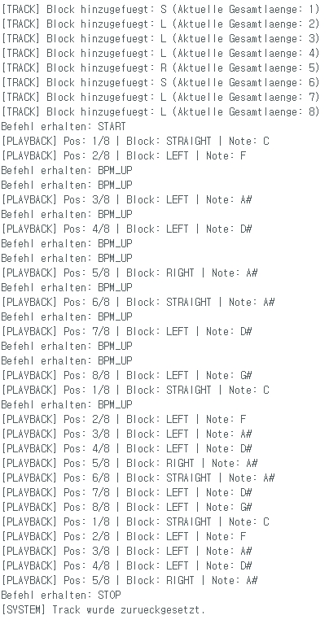

# RACETRACK – To-Do Liste | Yeonsu

- [x] **1. Entwicklungsumgebung**
  - [x] ESP32 konfigurieren & Blink-Test erfolgreich

- [x] **2. UART-Kommunikation**
  - [x] ESP32 <-> PyBadge verbinden
  - [x] UART testen
  - [x] Befehle senden/empfangen (BPM_UP / BPM_DOWN / START / STOP)

- [x] **3. PyBadge (UI)**
  - [x] UART-Empfang implementieren
  - [x] Buttons -> UART-Befehle senden
  - [x] Display für NOTE / BPM / STATUS
  - [x] Nur UI-Logik (keine Berechnung)

- [x] **4. ESP32 Datenstruktur**
  - [x] BlockType (LEFT / RIGHT / STRAIGHT)
  - [x] Track-Array + playhead

- [x] **5. Eingabesystem (ESP32)**
  - [x] Serielle Eingabe (L / R / S / X)
  - [x] Track-Erstellung testen

Ich habe das technische Fundament erfolgreich fertiggestellt und die UART-Verbindung zwischen ESP32 und PyBadge stabil eingerichtet. Auf dem PyBadge läuft die komplette UI-Logik (CircuitPython) zur Anzeige von BPM, Note und Status sowie zum Senden von Button-Befehlen. Auf dem ESP32 wurde die Track-Datenstruktur implementiert und auf 18 Blöcke optimiert. Das Eingabesystem über den PC-Serienmonitor liest Streckenbefehle (L/R/S/X) fehlerfrei in das Array ein.

---

- [x] **6. Musik-Engine (ESP32)**
  - [x] Circle of Fifths implementieren
  - [x] Notenberechnung basierend auf Track-Richtung

- [x] **7. Playback-Engine (ESP32)**
  - [x] Playhead-Loop implementieren
  - [x] BPM-System im ESP32
  - [x] Timing mit millis()

- [x] **8. Integrationstest**
  - [x] UART-Kommunikation testen (ESP32 <-> PyBadge)
  - [x] BPM beeinflusst Playback
  - [x] Track -> Note -> Loop funktioniert
  - [x] Display zeigt Live-Daten korrekt

Ich habe die Musik- und Playback-Engine des ESP32 erfolgreich implementiert. Die Notenberechnung (Quintenzirkel) passt sich dynamisch der Strecke an, inklusive sicherem Loop-Reset auf die Startnote. Das Playback-Timing wird nun flüssig über millis() gesteuert und durch BPM-Limits (60-240) abgesichert. Der Integrationstest bestätigt eine fehlerfreie Umwandlung der Tracks in Musik sowie eine optimierte Echtzeit-Anzeige auf dem PyBadge (150ms Update-Rate).

- [ ] **Optional (Future)**
  - [ ] Pedal-Eingang für BPM (ESP32 übernimmt Steuerung)
  - [ ] Buzzer/Audio-Ausgabe